# Luffy AI

## Team Luffy
Josh Kilcoyne
Ezra Daniels
James Carlyle
2 March 2026

AI for Sustainability CDT

---
# Problem Statement

Industrial applications of artificial neural controllers can improve the efficiency of existing processes but often struggle with non-stationary environments, where standard control theory and fixed-parameter Deep Reinforcement Learning (DRL) methods fail to adapt over time. 

Neuroevolutionary approaches, such as NEAT, offer a promising alternative by evolving both network structures and parameters, yielding lightweight, efficient topologies suitable for edge deployment. 

By incorporating plasticity rules like Hebbian learning and Oja’s rule, NEAT agents can adapt to changing environments, supporting resilient and autonomous industrial operations. 

The project is a collaboration with Luffy.AI and has three concrete objectives: 

1) Extend NEAT with learning rules. 
2) Benchmark against standard DRL methods.
3) Run ablation studies - systematically change rules to understand how each contributes to  performance.

---
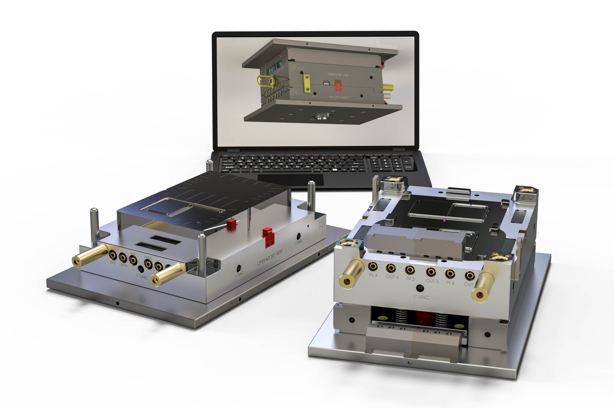
## Introduction to NEAT (Part 1)
NeuroEvolution of Augmenting Topologies (NEAT) evolves neural networks using genetic algorithms, rather than training with gradient descent.

1. Genomes encode networks as a list of node genes and connection genes (input node, output node, weight, enabled flag, innovation number). 
2. Mutation can change weights, add a new connection between existing nodes, add a new node by splitting a connection.
3. Crossover matches parent genomes and inherits genes randomly from either parent. If the gene is only in one parent, inherited from 'fitter' parent.
4. A mutated network with a different structure is regarded as a different species, and only has to compete with other members of that species, allowing mutations to survive long enough to improve.

---
## Introduction to NEAT (Part 2)
**Weight Mutation**: A connection weight is randomly perturbed using Gaussian distribution. 
**Connection-Add Mutation**: Randomly selects two currently-unconnected nodes. An innovation number is created for each never-seen-before pair. **Node-Add Mutation** Converts connection to new node and new connections, weights 1.0 and the old connection weight. Enable/disable: inpermanent change.
**Crossover**: Two parent genomes from same species. Connection genes matched by innovation; inherited from fitter parent.
**Each generation**: Each species keeps a single random genome from previous generation. Each individual genome is compared - below threshold, creates a new species.

Each individual's fitness score is divided by species size; determines how many offspring the species can produce. So a lone mutant currently scoring poorly gets a protected slice of reproduction. Without speciation, no complexity.

Typical NEAT: 100-500 genomes, 100-5000 generations. i.e. 100K networks instantiated and run. NEAT doesn't need labeled data, better for control problems. NEAT is effectively a broad and parallel random search, so very sample-inefficient c.w. backpropagation, but doesn't need differentiability.

---
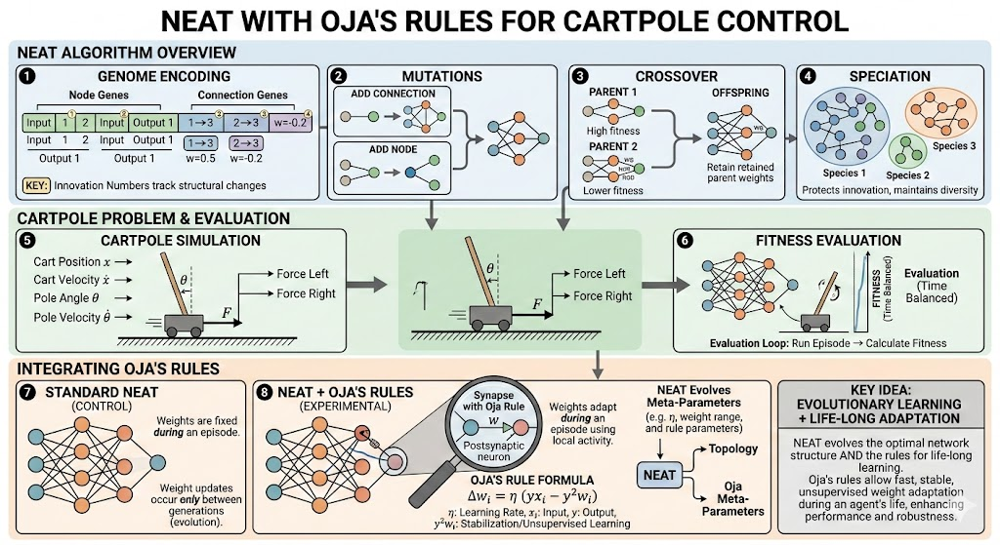

--- 
# Rules for Evaluation
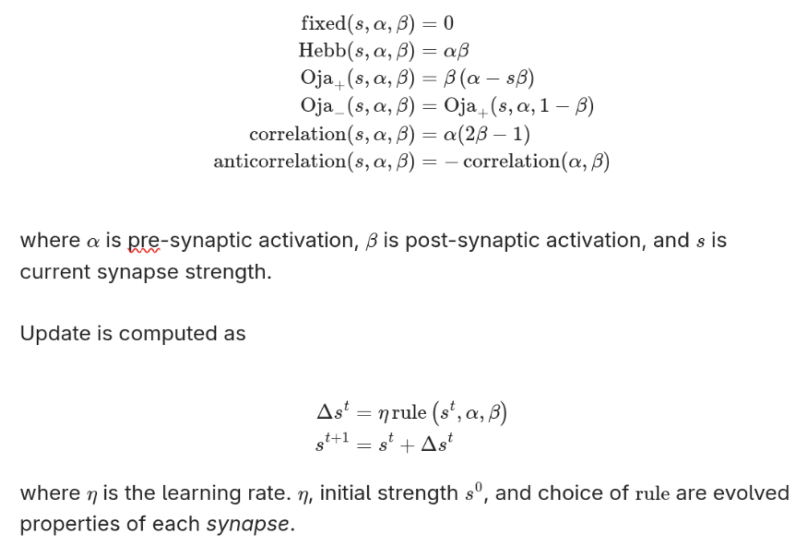

--- 
# How will Ablation be measured?
* The primary measure is fitness.
* We plan to follow this assessment protocol:
  
1. Stage: Full model. Objective: Baseline, understand the basic behaviour of the trained system.
2. Frozen weights (no plasticity). Objective: Value of online learning.
3. Remove normalization (pure Hebbian). Objective: Oja / other rules' stabilization term.
4. Zero learning rate. Objective: Structural vs. learning contribution.
5. Random plasticity coefficients. Objective: NEAT-evolved plasticity parameters.
6. Rule swap (Oja ↔ BCM). Objective: Rule-specific contribution

---
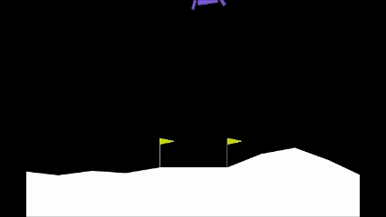
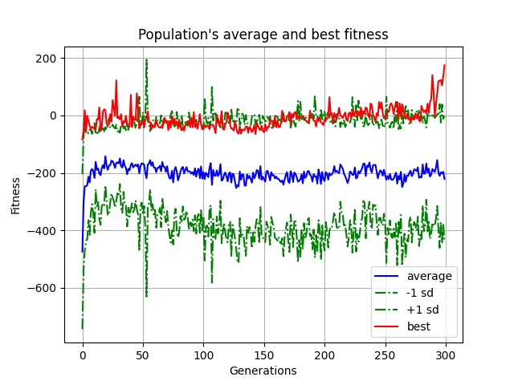
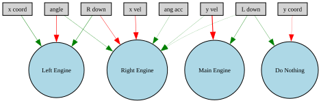

# Lunar Lander Implementation

⁠Initial implementation of NEAT in simulation environment used a lunar-lander control problem
* ⁠Explored simulations of various difficulties (greater number of inputs, more complex outputs).
* No Hebbian (Oja etc.) learning at this stage.

---
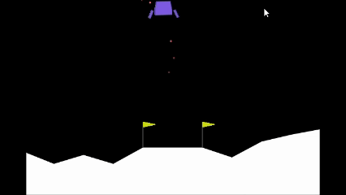
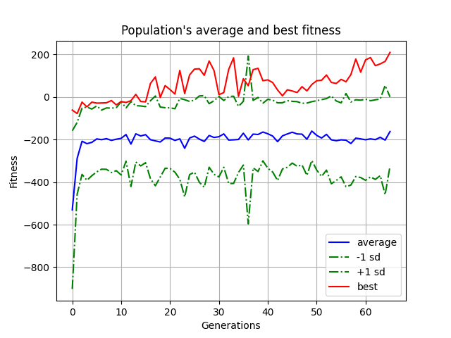

# Iterative Runs

This run uses the same problem with same fitness, but due to the randomness developed entirely different networks.

---
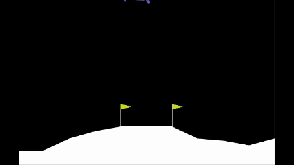
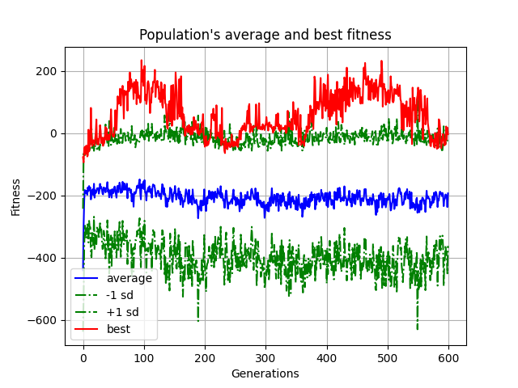
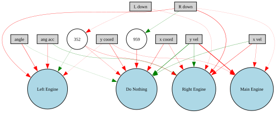
# Suboptimal Divergence

Network 5 didn't work as we wanted: We wer trying to get to fitness 250 but peak fitness has evolved away from an earlier optimum. This requires further investigation and hyperparamter tuning.

---
# ⁠Next steps
*	Develop greater understanding of the effect of hyperparameters on training speed and efficiency.
*	Implement plasticity rules.
